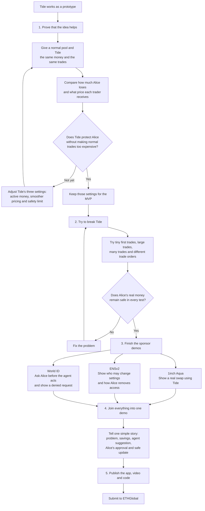

# Tide Working Plan

## Current position

Tide already has a working technical prototype: shared AMM math, Aqua custom opcodes, a Uniswap v4
hook, ENSv2-controlled parameters, a World ID approval flow, tests, deployments, and a dashboard.

The main remaining problem is **proof**, not feature count. The project needs a reproducible
before/after result showing that Tide reduces LP loss or arbitrage extraction while keeping acceptable
prices for normal traders. Until that result exists, lambda, N, and delta are configuration choices
rather than a convincingly demonstrated strategy.

See [MATHEMATICS_MODEL.md](MATHEMATICS_MODEL.md) for all formulas and examples.

## Immediate next step

Build one reproducible benchmark that compares a normal constant-product AMM with Tide from the same
inventory and market-price movement.

Use this first scenario:

| Input | Baseline | Tide |
| --- | --- | --- |
| Starting inventory | Same reserves | Same reserves |
| External price movement | Same movement | Same movement |
| First trade | Full-pool N = 1 | lambda = 0.5, first fill N = 1 |
| Later ordinary trade | Full-pool N = 1 | Candidate N = 2 and N = 4 |
| Drift guard | None | delta = 0.5% |
| Fees | Use the same fee on both sides | Use the same fee on both sides |

Record:

- LP loss or LVR;
- arbitrageur profit;
- ordinary-trader output and slippage;
- whether delta accepted or repriced each later trade;
- passive-buffer usage;
- gas overhead.

The output should be one JSON/CSV result, one chart, and one test or script that anybody can rerun.

### First decision gate

Tide is ready to move forward only when the benchmark can answer:

> Under the same reserves and price path, how much LP loss does Tide prevent, and what does that
> protection cost an ordinary trader?

## Simple MVP workflow

## Work phases

| Phase | Frontier | Main deliverable | Exit condition |
| --- | --- | --- | --- |
| 1 | Economic validity | Baseline-versus-Tide benchmark and chart | A measurable benefit and its trader cost are clearly stated |
| 2 | Mechanism safety | Adversarial tests and a frozen parameter policy | Safety, solvency, rounding, ordering, and cross-venue tests pass |
| 3 | Sponsor completeness | Three independent working vertical slices | Each sponsor's required successful and failure paths work live |
| 4 | Presentation | One connected five-minute demo | The story works without manually editing state |
| 5 | Submission reliability | Public app, video, docs, backup recording | A judge can reproduce or understand every central claim |

## Phase 1: economic evidence

Test at least these scenarios:

1. One external price jump followed by one arbitrage trade.
2. A small ordinary trade later in the same block that receives N pricing.
3. A large later trade that exceeds delta and falls back to N = 1.
4. Several later trades in the same direction.
5. Trades reversing direction inside the same block.
6. A dust transaction taking the first-fill position.
7. Transaction reordering or sandwich-like ordering.
8. Low, medium, and high volatility paths.
9. N in 1, 2, and 4 with lambda in 0.25, 0.5, and 1.
10. Delta sensitivity, including 0.25%, 0.5%, 1%, and 2%.

Do not select N = 4 merely because it produces an attractive demo. Select the MVP policy from the
measured LP-loss, slippage, and guard-rejection trade-off.

## Phase 2: safety hardening

Priority checks:

- Confirm that repeated later fills cannot walk around the fixed anchor.
- Test dust-first and reordered transactions against the “first fill is informed” assumption.
- Add coupled limits so independently valid lambda, N, and delta values cannot form an unsafe triple.
- Align the one-basis-point research frontier with the contracts' current zero-fee behavior, or add
  the same explicit fee to both venues and the benchmark.
- Verify exact-input and exact-output rounding in both directions.
- Verify buffer top-up and insolvency reverts at boundary values.
- Preserve identical Aqua and Uniswap v4 results for identical inputs.
- Bind World ID ownership to the wallet securely and require fresh authentication time.
- Make ENS and on-chain parameter updates recoverable if only one write succeeds.
- Restrict proposal creation and surface fill/indexing errors instead of silently returning empty data.

## Phase 3: sponsor targets

### 1inch Aqua

The headline deliverable is not “we imported Aqua.” It is:

> Tide's custom SwapVM position exposes only lambda inventory to the first fill, gives safe later flow
> virtual depth, and produces a measured improvement over the baseline.

Show a real token transfer, custom instructions, strategy state, and the numerical before/after result.

### ENSv2

ENS must be operational control infrastructure:

- the strategy and manager have ENSv2 identities;
- lambda, N, and delta are real resolver records;
- the agent can modify only explicitly granted records;
- unauthorized writes fail;
- revocation works live.

### World ID for Agents

Use World ID at the consequential moment: approving a parameter change that affects LP funds.

Show:

- the agent proposes a change;
- the owner completes fresh authentication;
- the backend validates the result;
- the protected ENS/on-chain update occurs;
- cancellation, expiry, denial, or subject mismatch leaves parameters unchanged.

## Phase 4: five-minute demo order

1. Explain the LP problem in one sentence.
2. Run the baseline price movement and show bot profit or LP loss.
3. Run Tide with the same starting state and show the difference.
4. Show a small later trade receiving N pricing.
5. Show a large later trade crossing delta and falling back safely.
6. Let the agent propose a lambda adjustment.
7. Approve it through World ID.
8. Show the scoped ENS record and on-chain parameter update.
9. Revoke the agent or demonstrate an unauthorized action failing.
10. Finish with one numerical claim that the benchmark supports.

## Recommended priority

Work in this order:

1. Baseline-versus-Tide benchmark.
2. Dust-first, repeated-fill, reverse-direction, and reordering tests.
3. Decide and freeze the MVP parameter policy.
4. Fix authentication and parameter-write safety gaps.
5. Record the integrated demo.
6. Finish public deployment, team details, video, and submission material.

