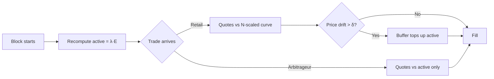
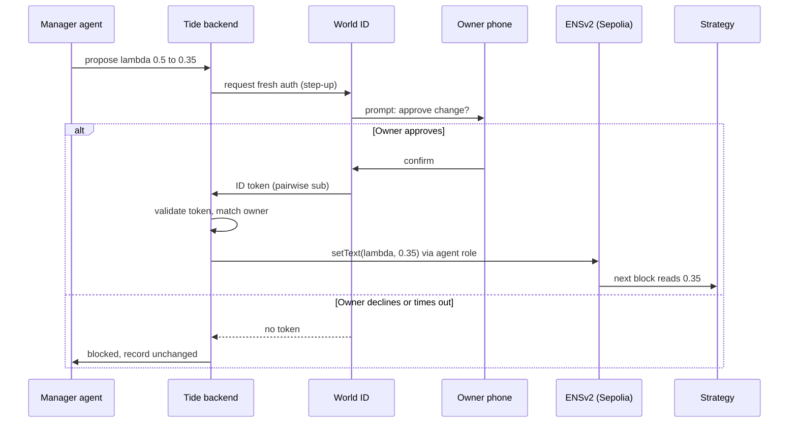

# Tide — idea brief
> **Note (Sep 27).** This is the original brief. Two things changed while building: a flat fee now backs the virtual curve with the bound (N − 1)·δ ≤ 2·fee, and the manager runs on its own inside owner-set guardrails, with the World ID step-up only for changes beyond them. `MATHEMATICS_MODEL.md` and the whitepaper describe the shipped design.

Sep 25, 2026 · @Arnab

## Summary

Tide is a liquidity strategy that cuts an LP's per-block arbitrage loss by exposing only a fraction λ of their reserves to each block, while quoting uninformed traders against a virtually deeper pool backed by the idle remainder. It ships as a 1inch Aqua SwapVM program and a Uniswap v4 hook built from one shared math library. A manager agent tunes λ from a computed frontier, but every change requires a fresh World ID confirmation from the owner and is written to an ENSv2 record the agent may edit and nothing else.

The pitch in one line: an AMM that shows the arbitrageur half the vault, gives honest traders a deeper pool than really exists, and lets a bot tune it only with a human's fingerprint on the dial.

## Problem

Passive LPs lose money to the first trade of every block. An AMM's price is stale until someone trades, so an arbitrageur who knows the fresh market price trades against the whole pool at the old one. That loss is loss-versus-rebalancing (LVR); for a constant-product pool it runs at roughly σ²/8 of pool value per unit time, which at 60% annual volatility is about 4.5% of capital per year before fees.

Who loses: retail LPs on major pairs, DAO treasuries providing liquidity for their own token, and market makers on Aqua who currently write plain constant-product or concentrated programs.

Why shipped fixes fall short:

| Approach | Example | What it does | Gap |
| --- | --- | --- | --- |
| Dynamic or auctioned fees | am-AMM (Bunni) | Prices the arbitrage and taxes it | Arbitrageur still sees the whole pool; fee leaks to retail |
| Batch clearing | CoW AMM, Angstrom | Removes intra-block ordering edge | Needs off-chain solvers or a node network |
| Rebates | Arrakis LVR-rebate POC | Discounts the arb trade | Hard-coded parameter, still full exposure |
| Exposure reduction | none in production | Show the arbitrageur less | This is Tide |

The research exists: partially active AMMs (arXiv 2602.09887, Feb 2026) and collateral-backed virtual liquidity (arXiv 2605.19267, May 2026). Neither has an implementation.

## Solution

Tide has two mechanisms in the pool and one governance layer around it.

**Active split.** At the first quote of each block the strategy recomputes active reserves as λ of total equity and holds the remainder passive. The block's arbitrageur can only trade against the active part, so expected LVR scales by λ:

```latex
\mathbb{E}[\mathrm{LVR}_{\mathrm{PA}}] = \lambda \cdot \frac{\sigma^2}{8} \cdot E \cdot \Delta + O(\Delta^{3/2})
```

The cost is drift: the pool's asset mix wanders from target, so λ is chosen on a frontier that trades LVR against tracking error.

**Virtual depth with a buffer.** Uninformed trades are quoted against the invariant x·y = N²k, so a trade of size q sees slippage of roughly q/(N·x) instead of q/x. When the pool price drifts more than δ from reference, the passive reserves top the active side up. In Aqua the buffer is the maker's own wallet balance under the Shared Liquidity Ratio; in Uniswap v4 it is a hook-held ERC-6909 claim.

**Governed tuning.** A manager agent reads the frontier and proposes λ, N and δ. It can only write them after the owner completes a fresh World ID authentication, and its ENSv2 role lets it edit those three text records on the strategy's subname and nothing else. Revoking the agent is one Enhanced Access Control call.



One block of Tide: arbitrage sees the active slice, retail sees the deep virtual curve, the buffer engages only on real price moves.

## Use cases

| Who | Situation | What Tide gives them |
| --- | --- | --- |
| Self-custodial market maker on Aqua | Runs constant-product programs on ETH/USDC and bleeds to resolvers' arbitrage every block | Ships one Tide program instead; keeps inventory in wallet, exposes λ of it per block, earns the same retail flow with less LVR |
| DAO treasury | Provides liquidity for its own token and wants a policy, not a trader, deciding parameters | Strategy parameters live as ENS records; the treasury's agent proposes, a signer approves via World ID, the record is the audit trail |
| Retail LP on Uniswap v4 | Wants passive exposure without becoming the arbitrageur's counterparty | Adds liquidity to a Tide-hooked pool; λ is set by the pool operator, LVR reduction shows up as higher net APR |
| Retail trader | Wants low slippage on mid-size swaps | Sees an N-times deeper virtual curve than the pool actually holds |
| Pool operator or protocol | Wants to delegate tuning to automation safely | Grants the agent a scoped ENS role, requires fresh human auth for writes, revokes in one call |

The hackathon demo follows the first and second rows: a maker on Aqua and a treasury-style approval flow.

## Roles

| Role | Human or agent | Does | Holds |
| --- | --- | --- | --- |
| Owner (maker) | Human | Ships and docks the strategy, approves parameter changes, can revoke the agent | Wallet with inventory, World ID, ENS name `tide.eth` |
| Manager agent | Agent | Computes the λ frontier, proposes changes, writes approved values to ENS | ENS agent name `manager.tide.eth`, scoped EAC role, OIDC client credentials |
| Resolver / arbitrageur | Agent | Fills against the active slice when price is stale | KycNFT (Aqua) or any address (v4) |
| Retail trader | Human or agent | Swaps against the virtual curve | Any wallet |
| Passive LP (v4 only) | Human | Adds liquidity to a Tide-hooked pool | LP position |

## User flow

The optimal flow has three phases: set up once, run every block with no user action, tune occasionally with one tap. The owner touches the product at steps 1 to 5 and step 9; everything else is automatic.

### Phase 1: Set up (once, about 4 minutes)

1. **Connect wallet and pick a pair.** Owner opens the Tide app, connects, selects ETH/USDC and the venue (Aqua, Uniswap v4, or both).
2. **Choose a risk profile.** Owner drags one slider labelled "how much of my inventory can the market see per block" (this is λ). The frontier chart updates live: expected LVR saved vs expected drift. Default 0.5. Advanced panel exposes N (virtual depth) and δ (buffer threshold) with defaults 4 and 0.5%.
3. **Name the strategy.** Owner types a label; the app registers `eth-usdc.tide.eth` as a subname on Sepolia with a Permissioned Resolver and writes the three parameters and the strategy hash as text records. One transaction.
4. **Ship.** Owner signs one Aqua `ship()` (and one hook `initialize()` if v4 is selected). Inventory stays in the owner's wallet; nothing is deposited.
5. **Optionally enable the manager.** Owner toggles "let an agent tune this". The app registers `manager.tide.eth`, grants it the EAC role scoped to the three records, and binds the owner's World ID through the sandbox OIDC flow (one login). The agent can now propose but cannot yet write without step 9.

### Phase 2: Run (every block, no action)

6. **Block starts.** First quote of a new block triggers the active split: active = λ · equity, remainder passive.
7. **Trades fill.** A resolver's arbitrage fills against the active slice only. Retail swaps are quoted against the N-scaled curve. If pool price drifts past δ, the passive reserves top up the active side before the fill.
8. **Dashboard updates.** Owner sees fills, LVR avoided versus a plain constant-product baseline, and the current active/passive split. No action required.

### Phase 3: Tune (occasionally, one tap)

9. **Agent proposes.** Volatility changes; the agent recomputes the frontier and proposes λ 0.5 to 0.35 with a one-line reason and the projected effect. The backend requests fresh authentication from World ID for the bound owner.
10. **Owner approves on phone.** The World app shows "Tide manager wants to change λ on eth-usdc.tide.eth". Owner confirms. The backend validates the ID token server-side, checks the pairwise subject matches the owner, then the agent writes the ENS record. The strategy reads the new λ at the next block.
11. **Owner declines or ignores.** No token arrives, or the token fails validation. The record stays unchanged, the agent logs "blocked", and the dashboard shows the declined proposal.
12. **Owner revokes the agent.** One EAC call removes the role. Future proposals cannot write even with approval. Owner can dock the strategy at any time to stop trading; inventory was never moved.



The protected action is the ENS write; it happens only inside the approved branch and only through the agent's scoped role.

## User stories

Each story maps to a flow step and carries the acceptance test the demo must pass.

| # | As a | I want | So that | Accepted when |
| --- | --- | --- | --- | --- |
| 1 | Maker | to ship a Tide strategy without depositing funds | my inventory never leaves my wallet | `ship()` succeeds; wallet balance unchanged until first fill; Aqua `Swapped` event shows the pull at fill time |
| 2 | Maker | to pick how much of my inventory a block can see | I control my arbitrage exposure | Slider sets λ; frontier chart updates; λ is stored as an ENS text record readable via wildcard resolution |
| 3 | Maker | the first arbitrage of a block to hit only part of my reserves | I lose less to LVR | Test: same stale price, λ = 0.5 fill extracts about half the value a λ = 1 fill does; Monte-Carlo shows LP wealth above baseline |
| 4 | Retail trader | low slippage on a mid-size swap | I get a better price than pool size suggests | Quote for size q returns slippage within 5% of q/(N·x) while the buffer holds |
| 5 | Maker | the pool to stay solvent when price jumps | the virtual curve never promises more than I hold | Guard opcode reverts any fill that would exceed active + buffer; test covers the worst-case trade at δ |
| 6 | Maker | to delegate tuning to an agent | I do not watch volatility all day | Agent proposes with a reason; proposal appears in the dashboard within one block |
| 7 | Maker | any parameter change to need my fresh approval | the agent cannot act on stale consent | Write succeeds only after a World ID token validated server-side with the owner's pairwise subject; token older than the freshness window is rejected |
| 8 | Maker | a declined approval to change nothing | I can say no safely | Declined or timed-out prompt leaves the ENS record unchanged; agent log shows blocked; demo has this as its own video chapter |
| 9 | Maker | the agent to be able to edit only my three parameters | it cannot redirect funds or rename my strategy | EAC role grants setText on `lambda`, `N`, `delta` only; test: agent attempt to set `addr` or transfer the name reverts |
| 10 | Maker | to revoke the agent in one action | I can pull the plug | Single EAC call; subsequent approved proposal still fails to write |
| 11 | Passive LP (v4) | to add liquidity to a Tide pool like any other | I get the benefit without learning anything | Standard `modifyLiquidity` works; hook rejects JIT adds inside the block's first swap |
| 12 | Sponsor judge | to verify the integration from the README | I can score it in five minutes | README links file and line for each sponsor; fork script reproduces one fill on Aqua and one on v4 |

Stories 3, 5, 7 and 8 are the ones the whitepaper proves or the video demonstrates as failure paths; they carry the most judging weight.

## Sponsor tie-in by flow step

| Flow step | Sponsor | Why it is needed here, not bolted on |
| --- | --- | --- |
| 3, 9, 10 | ENSv2 | Parameters must be readable by the strategy and writable by exactly one scoped role; EAC and Permissioned Resolver are the only primitive that gives per-record delegation |
| 4, 6, 7 | 1inch Aqua | The passive reserve is the maker's wallet; SwapVM opcodes implement the split, the virtual quote and the solvency guard inside `quote()` and `swap()` |
| 4, 6, 7, 11 | Uniswap v4 | The same math as a hook proves venue independence; `beforeSwap` with `BeforeSwapDelta` carries the custom curve |
| 5, 9, 10, 11 | World ID for Agents | The protected action is a parameter write; fresh authentication with a pairwise subject is the minimum assurance that the owner, not a replayed session, approved it |
| 8 | Curvegrid | The dashboard is the product's own UI and doubles as the Digital Asset Dashboard entry; the manager is the AI Agent entry |

## Scope

In scope for the weekend:

- ETH/USDC only, one strategy per owner
- Aqua program with three custom opcodes on a redeployed router, demoed on a fork
- v4 hook passing the same test vectors, demoed on the same fork
- Sepolia ENSv2: parent name, one strategy subname, one agent subname, EAC role
- World ID for Agents sandbox: bind, step-up, validate, deny path
- Frontier solver and Monte-Carlo in Python, two charts reused in paper and video
- Dashboard reading ENS records and fill events

Out of scope, stated in the paper's limitations:

- Automatic λ selection without human approval
- Multi-pair or cross-venue rebalancing
- Mainnet deployment and audit
- Fee optimisation (the PA-AMM paper lists this as open)
- Sui, IDKit, Intercepta (no natural trust moment or payment in this flow; do not force them)

## Success metrics and demo checkpoints

| Metric | Target | Where it shows |
| --- | --- | --- |
| LVR reduction at λ = 0.5 vs baseline | 40% or more in Monte-Carlo (10,000 paths, σ = 60%, 12 s blocks) | Whitepaper figure 1, video 0:00 |
| Retail slippage improvement at N = 4 | 3x or more for a trade of 1% of active reserves | Whitepaper table 2 |
| Setup time for a new maker | Under 4 minutes, 3 signatures | Video phase 1 |
| Time from agent proposal to approved write | Under 60 seconds including phone tap | Video phase 3 |
| Denied path leaves state unchanged | 100% of attempts | Test suite, video chapter "blocked" |
| Sponsor requirement coverage | Every checkbox mapped to file and line | README appendix |

Demo checkpoints, in order: fork fill on Aqua (Sat 10:00), hook fill (Sat 16:00), approved and denied ENS writes (Sat 16:00), charts final (Sat 22:00), video cut (Sun 06:00), submit (Sun 09:00).
